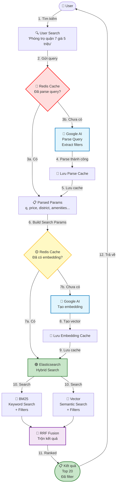

# KẾ HOẠCH CẢI THIỆN HỆ THỐNG SEARCH

## TỔNG QUAN

Kế hoạch này bao gồm 5 nhóm cải thiện chính:
1. **Type Safety** - Giảm `any` types, thêm interfaces
2. **Error Handling** - Thêm retry mechanism, circuit breaker
3. **Performance** - Thêm caching cho geocode, optimize queries
4. **Personalization** - Tích hợp từ `planuxsearch.md`
5. **Vector/Semantic Search & Hybrid Search** - Tìm kiếm theo ngữ nghĩa với Google AI + Elasticsearch

**Timeline tổng thể: ~14-16 tuần**

---

## PHẦN 1: TYPE SAFETY (Ưu tiên cao)

### Mục tiêu
Giảm `any` types từ 19 xuống < 5, tăng type safety cho codebase.

### 1.1. Tạo Interfaces & Types

**File mới: `src/modules/search/types.ts`**

```typescript
// Elasticsearch response types
export interface ElasticsearchHit {
  _id: string;
  _score: number;
  _source: SearchDocument;
  highlight?: Record<string, string[]>;
}

export interface SearchDocument {
  postId: number;
  roomId: number | null;
  title: string;
  description: string;
  category: string;
  type: 'rent' | 'roommate';
  price: number | null;
  area: number | null;
  address: {
    full: string;
    city: string;
    district: string;
    ward: string;
    provinceCode?: string;
    wardCode?: string;
  };
  coords: { lon: number; lat: number } | null;
  bedrooms?: number;
  bathrooms?: number;
  furniture?: string;
  legalStatus?: string;
  propertyType?: string;
  buildingName?: string;
  // ... các field khác
}

export interface SearchResponseItem {
  id: string;
  score: number;
  postId: number;
  roomId: number | null;
  title: string;
  description: string;
  category: string;
  type: 'rent' | 'roommate';
  price: number | null;
  area: number | null;
  address: SearchDocument['address'];
  images: string[];
  coords: { lon: number; lat: number } | null;
  createdAt: Date;
  bedrooms?: number;
  bathrooms?: number;
  furniture?: string;
  legalStatus?: string;
  propertyType?: string;
  buildingName?: string;
  // ... các field khác
  highlight?: Record<string, string[]>;
}

// Elasticsearch query types
export interface FunctionScoreFunction {
  filter?: any;
  weight?: number;
  gauss?: any;
}

export interface ElasticsearchQueryBody {
  track_total_hits: boolean;
  from: number;
  size: number;
  sort: any[];
  query: {
    function_score: {
      query: {
        bool: {
          must: any[];
          filter: any[];
        };
      };
      functions: FunctionScoreFunction[];
      boost_mode: 'sum' | 'multiply' | 'max' | 'min' | 'avg' | 'replace';
      score_mode: 'sum' | 'multiply' | 'max' | 'min' | 'avg' | 'first' | 'avg';
    };
  };
  highlight?: any;
}
```

### 1.2. Cập nhật SearchPostsParams

**Thêm các field còn thiếu:**
```typescript
export type SearchPostsParams = {
  // ... các field hiện tại
  priceComparison?: 'cheaper' | 'more_expensive'; // Thêm vào thay vì (p as any)
  minCreatedAt?: string; // Thêm vào thay vì (p as any)
  userId?: number; // Cho personalization (từ planuxsearch.md)
}
```

### 1.3. Refactor SearchService

**Thay đổi:**
- `buildResponseItem(h: any)` → `buildResponseItem(h: ElasticsearchHit): SearchResponseItem`
- `(p as any).priceComparison` → `p.priceComparison`
- `(p as any).minCreatedAt` → `p.minCreatedAt`
- `body as any` → `body: ElasticsearchQueryBody`

### Timeline: 1 tuần
- Day 1-2: Tạo interfaces và types
- Day 3-4: Refactor SearchService
- Day 5: Refactor SearchIndexerService, SearchWatcherService
- Day 6-7: Testing và fix lỗi TypeScript

---

## PHẦN 2: ERROR HANDLING (Ưu tiên cao)

### Mục tiêu
Thêm retry mechanism, circuit breaker, và error recovery cho các operations quan trọng.

### 2.1. Tạo Retry Utility

**File mới: `src/shared/utils/retry.util.ts`**

```typescript
export interface RetryOptions {
  maxRetries?: number;
  initialDelay?: number;
  maxDelay?: number;
  backoffFactor?: number;
  retryableErrors?: string[];
}

export async function retry<T>(
  fn: () => Promise<T>,
  options: RetryOptions = {}
): Promise<T> {
  const {
    maxRetries = 3,
    initialDelay = 1000,
    maxDelay = 10000,
    backoffFactor = 2,
    retryableErrors = ['ECONNREFUSED', 'ETIMEDOUT', 'ENOTFOUND'],
  } = options;

  let lastError: Error;
  let delay = initialDelay;

  for (let attempt = 0; attempt <= maxRetries; attempt++) {
    try {
      return await fn();
    } catch (error: any) {
      lastError = error;
      
      // Nếu không phải retryable error hoặc đã hết retry → throw
      if (attempt === maxRetries || !isRetryableError(error, retryableErrors)) {
        throw error;
      }

      // Exponential backoff
      await sleep(delay);
      delay = Math.min(delay * backoffFactor, maxDelay);
    }
  }

  throw lastError!;
}

function isRetryableError(error: any, retryableErrors: string[]): boolean {
  const errorCode = error?.code || error?.message || '';
  return retryableErrors.some(code => errorCode.includes(code));
}

function sleep(ms: number): Promise<void> {
  return new Promise(resolve => setTimeout(resolve, ms));
}
```

### 2.2. Tạo Circuit Breaker Utility

**File mới: `src/shared/utils/circuit-breaker.util.ts`**

```typescript
export class CircuitBreaker {
  private failures = 0;
  private lastFailureTime = 0;
  private state: 'closed' | 'open' | 'half-open' = 'closed';

  constructor(
    private readonly threshold: number = 5,
    private readonly timeout: number = 60000, // 1 minute
  ) {}

  async execute<T>(fn: () => Promise<T>): Promise<T> {
    if (this.state === 'open') {
      if (Date.now() - this.lastFailureTime > this.timeout) {
        this.state = 'half-open';
      } else {
        throw new Error('Circuit breaker is OPEN');
      }
    }

    try {
      const result = await fn();
      this.onSuccess();
      return result;
    } catch (error) {
      this.onFailure();
      throw error;
    }
  }

  private onSuccess() {
    this.failures = 0;
    this.state = 'closed';
  }

  private onFailure() {
    this.failures++;
    this.lastFailureTime = Date.now();
    
    if (this.failures >= this.threshold) {
      this.state = 'open';
    }
  }
}
```

### 2.3. Áp dụng vào SearchIndexerService

**Geocode fallback với retry:**
```typescript
// Thay vì:
const res = await this.geocoder.geocode(`${addressText}, Vietnam`);

// Dùng:
const res = await retry(
  () => this.geocoder.geocode(`${addressText}, Vietnam`),
  { maxRetries: 3, initialDelay: 1000 }
);
```

### 2.4. Áp dụng vào SearchWatcherService

**Change stream với error recovery:**
```typescript
cs.on('error', async (e: any) => {
  this.logger.error(`watchPosts stream error: ${e?.message || e}`);
  
  // Retry reconnect sau 5 giây
  await sleep(5000);
  this.watchPosts(); // Reconnect
});
```

### Timeline: 1 tuần
- Day 1-2: Tạo retry và circuit breaker utilities
- Day 3-4: Áp dụng vào SearchIndexerService (geocode)
- Day 5: Áp dụng vào SearchWatcherService (change streams)
- Day 6-7: Testing và monitoring

---

## PHẦN 3: PERFORMANCE - CACHING (Ưu tiên trung bình)

### Mục tiêu
Thêm caching cho geocode để giảm latency và chi phí API.

### 3.1. Tạo GeocodeCacheService

**File mới: `src/modules/search/geocode-cache.service.ts`**

```typescript
@Injectable()
export class GeocodeCacheService {
  private readonly cachePrefix = 'geo:';
  private readonly ttl = 60 * 60 * 24 * 7; // 7 ngày

  constructor(
    @Inject('REDIS_CLIENT') private readonly redis: Redis,
    private readonly logger: Logger,
  ) {}

  async get(address: string): Promise<{ lat: number; lon: number } | null> {
    const key = `${this.cachePrefix}${this.normalizeAddress(address)}`;
    const cached = await this.redis.get(key);
    
    if (cached) {
      return JSON.parse(cached);
    }
    
    return null;
  }

  async set(address: string, coords: { lat: number; lon: number }): Promise<void> {
    const key = `${this.cachePrefix}${this.normalizeAddress(address)}`;
    await this.redis.setex(key, this.ttl, JSON.stringify(coords));
  }

  private normalizeAddress(address: string): string {
    return address.toLowerCase().trim().replace(/\s+/g, ' ');
  }
}
```

### 3.2. Cập nhật SearchIndexerService

**Sử dụng cache:**
```typescript
// Trước khi geocode, check cache
const cached = await this.geocodeCache.get(addressText);
if (cached) {
  lon = cached.lon;
  lat = cached.lat;
} else {
  // Geocode và cache lại
  const res = await retry(() => this.geocoder.geocode(...));
  if (res) {
    lon = res.longitude;
    lat = res.latitude;
    await this.geocodeCache.set(addressText, { lat, lon });
  }
}
```

### 3.3. Cập nhật SearchController.geocode

**Sử dụng cache:**
```typescript
@Get('geocode')
async geocodeAddress(@Query('address') address: string) {
  // Check cache trước
  const cached = await this.geocodeCache.get(address);
  if (cached) {
    return cached;
  }

  // Geocode và cache lại
  const result = await this.geocodeAddressInternal(address);
  if (result) {
    await this.geocodeCache.set(address, { lat: result.lat, lon: result.lon });
  }
  
  return result;
}
```

### Timeline: 3 ngày
- Day 1: Tạo GeocodeCacheService
- Day 2: Tích hợp vào SearchIndexerService và SearchController
- Day 3: Testing và monitoring cache hit rate

---

## PHẦN 4: PERSONALIZATION (Ưu tiên trung bình - từ planuxsearch.md)

### Mục tiêu
Tích hợp personalization dựa trên lịch sử hành vi của user.

### 4.1. Database Schema (Bước 1 từ planuxsearch.md)

**Collections:**
- `user_search_history` - Lưu lịch sử search
- `user_view_history` - Lưu lịch sử xem bài đăng
- `user_preferences` - Cache preferences (optional, có thể tính real-time)

**Timeline: 2 tuần** (từ planuxsearch.md)

### 4.2. Tracking Service (Bước 2 từ planuxsearch.md)

**File mới: `src/modules/search/user-behavior-tracking.service.ts`**

**Chức năng:**
- `trackSearch(userId, query, filters, resultCount)`
- `trackView(userId, postId, postData, action, duration)`
- `trackClick(userId, postId)`
- `trackContact(userId, postId)`
- `trackSave(userId, postId)`

**Timeline: 2 tuần** (từ planuxsearch.md)

### 4.3. Preference Service (Bước 3 từ planuxsearch.md)

**File mới: `src/modules/search/user-preference.service.ts`**

**Chức năng:**
- `calculatePreferences(userId)`: Tính từ history
- `getPreferences(userId)`: Lấy từ cache hoặc tính lại
- `updatePreferences(userId)`: Cập nhật khi có hành vi mới

**Caching:**
- Redis key: `user:pref:${userId}`
- TTL: 24h
- Invalidate khi có hành vi quan trọng

**Timeline: 1 tuần** (từ planuxsearch.md)

### 4.4. Tích hợp vào SearchService (Bước 4 từ planuxsearch.md)

**Cập nhật `SearchService.searchPosts()`:**

```typescript
// Thêm userId vào SearchPostsParams
export type SearchPostsParams = {
  // ... existing
  userId?: number;
}

// Trong buildFunctions, thêm personalization boost:
const buildFunctions = (isCategoryBoost = false, preferences?: UserPreferences) => {
  const functions: any[] = [];
  
  // ... existing Tier 1-4 logic ...
  
  // Personalization boost (ưu tiên thấp hơn Tier nhưng cao hơn default)
  if (preferences) {
    // Boost category
    if (preferences.categoryWeights['chung-cu'] > 0.5) {
      functions.push({
        filter: { term: { category: 'chung-cu' } },
        weight: preferences.categoryWeights['chung-cu'] * 10,
      });
    }
    
    // Boost location
    // Boost amenities
    // ...
  }
  
  return functions;
};
```

**Timeline: 1 tuần** (từ planuxsearch.md)

### 4.5. API Endpoints (Bước 5 từ planuxsearch.md)

**Tracking endpoints:**
- `POST /api/search/track/view`
- `POST /api/search/track/click`
- `POST /api/search/track/contact`
- `POST /api/search/track/save`

**Search endpoints (cập nhật):**
- `GET /api/search/posts?userId=123&q=...`
- `GET /api/search/nlp?userId=123&q=...`

**Timeline: 1 tuần** (từ planuxsearch.md)

### Timeline tổng: 7-8 tuần (từ planuxsearch.md)

---

## KẾ HOẠCH TỔNG HỢP & ƯU TIÊN

### Phase 1: Foundation (Tuần 1-2)
**Mục tiêu:** Cải thiện code quality và stability

1. **Type Safety** (Tuần 1)
   - Tạo interfaces và types
   - Refactor SearchService
   - Refactor các service khác

2. **Error Handling** (Tuần 2)
   - Tạo retry và circuit breaker utilities
   - Áp dụng vào geocode fallback
   - Áp dụng vào change streams

**Kết quả:** Code ổn định hơn, dễ maintain hơn

---

### Phase 2: Performance (Tuần 3)
**Mục tiêu:** Tối ưu performance

3. **Geocode Caching** (Tuần 3)
   - Tạo GeocodeCacheService
   - Tích hợp vào SearchIndexerService
   - Tích hợp vào SearchController

**Kết quả:** Giảm latency và chi phí geocode API

---

### Phase 3: Personalization (Tuần 4-11)
**Mục tiêu:** Thêm tính năng personalization

4. **Personalization** (Tuần 4-11, từ planuxsearch.md)
   - Database schema (Tuần 4-5)
   - Tracking service (Tuần 6-7)
   - Preference service (Tuần 8)
   - Integration (Tuần 9)
   - API endpoints (Tuần 10)
   - Testing & Rollout (Tuần 11)

**Kết quả:** Search thông minh hơn, UX tốt hơn

---

## TIMELINE TỔNG THỂ

| Tuần | Task | Ưu tiên | Phụ thuộc |
|------|------|---------|-----------|
| 1 | Type Safety | Cao | - |
| 2 | Error Handling | Cao | Type Safety |
| 3 | Geocode Caching | Trung bình | Error Handling |
| 4-5 | Personalization: Database | Trung bình | - |
| 6-7 | Personalization: Tracking | Trung bình | Database |
| 8 | Personalization: Preference | Trung bình | Tracking |
| 9 | Personalization: Integration | Trung bình | Preference |
| 10 | Personalization: API | Trung bình | Integration |
| 11 | Personalization: Testing | Trung bình | API |

**Tổng: 11 tuần**

---

## LƯU Ý QUAN TRỌNG

### 1. **Thứ tự thực hiện:**
- ✅ **Bắt đầu với Type Safety và Error Handling** (Phase 1) - Quan trọng cho stability
- ✅ **Sau đó Performance** (Phase 2) - Cải thiện UX
- ✅ **Cuối cùng Personalization** (Phase 3) - Feature mới

### 2. **Có thể làm song song:**
- Type Safety và Error Handling có thể làm song song (khác files)
- Geocode Caching có thể làm song song với Personalization (khác modules)

### 3. **Có thể bỏ qua nếu không quan trọng:**
- ⚠️ **Geocode Caching**: Có thể bỏ qua nếu không có vấn đề performance
- ⚠️ **Personalization**: Có thể bỏ qua nếu không cần tính năng này ngay

### 4. **Minimum Viable:**
- ✅ **Type Safety**: Nên làm (quan trọng cho maintainability)
- ✅ **Error Handling**: Nên làm (quan trọng cho stability)
- ⚠️ **Geocode Caching**: Có thể làm sau
- ⚠️ **Personalization**: Có thể làm sau

---

## KHUYẾN NGHỊ

### **Nếu chỉ có 2-3 tuần:**
1. ✅ Type Safety (1 tuần)
2. ✅ Error Handling (1 tuần)
3. ⚠️ Geocode Caching (1 tuần) - Optional

### **Nếu có 4-6 tuần:**
1. ✅ Type Safety (1 tuần)
2. ✅ Error Handling (1 tuần)
3. ✅ Geocode Caching (1 tuần)
4. ⚠️ Personalization: Database + Tracking (2 tuần) - Bắt đầu

### **Nếu có đủ 11 tuần:**
1. ✅ Làm tất cả theo timeline

---

## KẾT LUẬN

Kế hoạch này kết hợp:
- ✅ **Type Safety** - Cải thiện code quality
- ✅ **Error Handling** - Tăng stability
- ✅ **Performance** - Tối ưu caching
- ✅ **Personalization** - Feature mới (từ planuxsearch.md)

**Có thể thực hiện từng phần, không cần làm hết một lúc.**

---

## PHẦN 5: VECTOR/SEMANTIC SEARCH & HYBRID SEARCH (Ưu tiên cao - Công nghệ hiện đại)

### 🎯 Mục tiêu

Nâng cấp hệ thống tìm kiếm từ **keyword matching** sang **semantic understanding**:
- **Semantic Search**: Tìm kiếm theo ngữ nghĩa, không cần đúng từ khóa
- **Hybrid Search**: Kết hợp BM25 (keyword) + Vector (semantic) để tối ưu độ chính xác
- **Tự động xử lý**: Lỗi chính tả, từ địa phương, synonyms

**Ví dụ thực tế:**
- User tìm: "chung cư thoáng mát" 
- Dữ liệu có: "căn hộ nhiều cửa sổ"
- **Keyword search**: ❌ Không tìm thấy (không khớp từ nào)
- **Semantic search**: ✅ Tìm thấy (hiểu "thoáng mát" = "nhiều cửa sổ")

---

### 📋 Tổng quan kiến trúc

**Flow hoạt động đầy đủ:**
```
User Query 
  → AI Parsing Query (Google Gemini) - Extract filters (price, location, amenities...)
    ↓ (cache parsed result)
  → Check Embedding Cache (Redis)
    ↓ (nếu chưa có)
  → Google AI (tạo embedding cho semantic search)
    ↓ (cache embedding)
  → Elasticsearch Hybrid Search (BM25 + Vector)
    ↓
  → RRF Fusion (trộn kết quả)
    ↓
  → Kết quả (đã filter theo parsed params)
```

**Công nghệ sử dụng:**
- **Google AI (Gemini)**: 
  - **AI Parsing**: Extract structured filters từ natural language query
  - **Embeddings**: Tạo vector embeddings cho semantic search
- **Elasticsearch**: Hybrid search (BM25 + KNN Vector)
- **RRF (Reciprocal Rank Fusion)**: Trộn kết quả từ 2 thuật toán
- **Redis**: Cache parsed queries và embeddings

---

### 🔧 BƯỚC 0: Tích hợp AI Parsing Query vào Hybrid Search Flow (Day 1)

**File: `src/modules/search/search.service.ts` hoặc tạo wrapper service**

**Tác dụng:**
- Tích hợp NLP Search Service (đã có) vào hybrid search flow
- Parse query trước khi tạo embedding và search
- Extract structured filters: price, location, amenities, bedrooms, etc.

**Logic:**
```typescript
// Option 1: Tích hợp trực tiếp vào SearchService
async searchPostsWithNLP(rawQuery: string, params?: Partial<SearchPostsParams>) {
  // 1. AI Parsing Query (có cache)
  const parsed = await this.nlpSearchService.parseQuery(rawQuery);
  // parsed = { q, minPrice, maxPrice, district, amenities, ... }
  
  // 2. Merge với params có sẵn
  const searchParams: SearchPostsParams = {
    ...parsed,
    ...params, // Override nếu có
  };
  
  // 3. Hybrid Search với parsed params
  return this.searchPosts(searchParams);
}

// Option 2: Tạo wrapper service
@Injectable()
export class HybridSearchService {
  async search(rawQuery: string) {
    // 1. Parse query
    const parsed = await this.nlpService.parseQuery(rawQuery);
    
    // 2. Hybrid search với parsed params
    return this.searchService.searchPostsWithHybrid(parsed);
  }
}
```

**Tại sao cần:**
- **AI Parsing**: Extract filters từ natural language ("phòng trọ quận 7 giá 5 triệu")
- **Structured Filters**: Áp dụng filters chính xác vào Elasticsearch query
- **Cache**: Cache parsed results để giảm AI calls
- **Tích hợp**: Kết hợp NLP parsing + Hybrid search = Search thông minh nhất

---

### 🔧 BƯỚC 1: Tạo Embedding Service (Day 1-2)

**File mới: `src/modules/search/embedding.service.ts`**

**Tác dụng:**
- Service trung tâm để tạo embeddings từ Google AI
- Cache embeddings để giảm chi phí API
- Normalize text trước khi tạo embedding

**Logic:**
```typescript
@Injectable()
export class EmbeddingService {
  private readonly genAI: GoogleGenerativeAI;
  private readonly redis: Redis;
  
  /**
   * Tạo embedding cho text (query hoặc document)
   * - Cache trong Redis (1 giờ cho query, 7 ngày cho document)
   * - Dùng Google AI embedding model
   * - Trả về vector 768 dimensions
   */
  async createEmbedding(text: string, type: 'query' | 'document'): Promise<number[]>
  
  /**
   * Batch create embeddings (cho indexing documents)
   * - Xử lý 10 documents/lần để tránh rate limit
   * - Retry với exponential backoff
   */
  async createEmbeddingsBatch(texts: string[]): Promise<number[][]>
}
```

**Tại sao cần:**
- Tái sử dụng code tạo embedding
- Cache để tiết kiệm chi phí Google AI API
- Batch processing cho performance

---

### 🔧 BƯỚC 2: Cập nhật Elasticsearch Index Mapping (Day 2-3)

**File: `src/modules/search/search-indexer.service.ts`**

**Tác dụng:**
- Thêm field `dense_vector` vào Elasticsearch index
- Cho phép Elasticsearch lưu và search vector embeddings
- Hỗ trợ KNN (K-Nearest Neighbors) search

**Logic:**
```typescript
// Cập nhật index mapping
const mapping = {
  properties: {
    // ... existing fields ...
    
    // Thêm vector field cho semantic search
    titleEmbedding: {
      type: 'dense_vector',
      dimensions: 768, // Google AI embedding dimension
      index: true,
      similarity: 'cosine' // Cosine similarity cho semantic search
    },
    
    descriptionEmbedding: {
      type: 'dense_vector',
      dimensions: 768,
      index: true,
      similarity: 'cosine'
    },
    
    // Combined embedding (title + description)
    contentEmbedding: {
      type: 'dense_vector',
      dimensions: 768,
      index: true,
      similarity: 'cosine'
    }
  }
};
```

**Tại sao cần:**
- Elasticsearch cần biết field nào là vector để search
- `dense_vector` type cho phép KNN search
- `cosine` similarity phù hợp cho semantic search

---

### 🔧 BƯỚC 3: Tạo Embeddings khi Index Documents (Day 3-4)

**File: `src/modules/search/search-indexer.service.ts`**

**Tác dụng:**
- Khi index document mới → tạo embeddings và lưu vào ES
- Batch processing để tối ưu performance
- Retry mechanism nếu Google AI fail

**Logic:**
```typescript
async indexPost(post: Post) {
  // ... existing indexing logic ...
  
  // Tạo embeddings cho semantic search
  const titleText = post.title || '';
  const descText = post.description || '';
  const combinedText = `${titleText} ${descText}`.trim();
  
  if (combinedText) {
    try {
      // Tạo embedding (có cache)
      const embedding = await this.embeddingService.createEmbedding(
        combinedText,
        'document'
      );
      
      // Thêm vào document
      document.contentEmbedding = embedding;
      
      // Optional: Tạo riêng cho title và description
      if (titleText) {
        document.titleEmbedding = await this.embeddingService.createEmbedding(
          titleText,
          'document'
        );
      }
    } catch (error) {
      // Log error nhưng không block indexing
      // Document vẫn được index với BM25 search
      this.logger.warn('Failed to create embedding, skipping semantic search');
    }
  }
  
  // Index vào Elasticsearch
  await this.es.index({ index: this.index, body: document });
}
```

**Tại sao cần:**
- Documents cần có embeddings để vector search hoạt động
- Batch processing giảm số lần gọi Google AI
- Fallback: Nếu embedding fail, vẫn index được (chỉ mất semantic search)

---

### 🔧 BƯỚC 4: Implement Hybrid Search trong SearchService (Day 4-6)

**Lưu ý:** Bước này cần tích hợp với AI Parsing từ Bước 0

**File: `src/modules/search/search.service.ts`**

**Tác dụng:**
- Kết hợp BM25 (keyword) + KNN Vector (semantic) search
- Dùng RRF (Reciprocal Rank Fusion) để trộn kết quả
- Tối ưu độ chính xác: keyword chính xác + semantic linh hoạt

**Logic:**
```typescript
async searchPosts(params: SearchPostsParams) {
  // 1. BM25 Query (keyword search - existing)
  const bm25Query = this.buildBM25Query(params);
  
  // 2. Vector Query (semantic search - new)
  let vectorQuery = null;
  if (params.q) {
    // Tạo embedding cho query
    const queryEmbedding = await this.embeddingService.createEmbedding(
      params.q,
      'query'
    );
    
    // KNN Vector search
    vectorQuery = {
      knn: {
        field: 'contentEmbedding',
        query_vector: queryEmbedding,
        k: 100, // Top 100 results
        num_candidates: 1000, // Search trong 1000 candidates
      }
    };
  }
  
  // 3. Hybrid Search: Kết hợp BM25 + Vector
  const searchBody = {
    query: bm25Query, // BM25 search
    knn: vectorQuery, // Vector search (chạy song song)
    
    // RRF: Trộn kết quả từ 2 thuật toán
    rank: {
      rrf: {
        window_size: 100, // Top 100 từ mỗi algorithm
        rank_constant: 20, // RRF constant (tuning parameter)
      }
    },
    
    // ... existing pagination, filters ...
  };
  
  const result = await this.es.search(searchBody);
  
  // 4. Merge và normalize scores
  return this.mergeHybridResults(result);
}
```

**Tại sao cần:**
- **BM25**: Tốt cho keyword chính xác (tên riêng, địa chỉ, mã số)
- **Vector**: Tốt cho semantic (mô tả, ý nghĩa, synonyms)
- **Hybrid**: Kết hợp ưu điểm cả hai → kết quả tốt nhất
- **RRF**: Thuật toán chuẩn để trộn kết quả từ nhiều nguồn

---

### 🔧 BƯỚC 5: Batch Re-indexing Documents hiện có (Day 6-7)

**File mới: `src/modules/search/reindex-embeddings.controller.ts`**

**Tác dụng:**
- Re-index tất cả documents hiện có để thêm embeddings
- Chạy background job, không block hệ thống
- Progress tracking và resume capability

**Logic:**
```typescript
@Controller('search/reindex')
export class ReindexEmbeddingsController {
  
  /**
   * Re-index embeddings cho tất cả documents
   * - Lấy tất cả documents từ ES
   * - Batch 10 documents/lần
   * - Tạo embeddings và update vào ES
   * - Progress tracking
   */
  @Post('embeddings')
  async reindexEmbeddings() {
    // 1. Lấy tất cả documents (scroll API)
    const documents = await this.getAllDocuments();
    
    // 2. Batch processing
    const batchSize = 10;
    let processed = 0;
    
    for (let i = 0; i < documents.length; i += batchSize) {
      const batch = documents.slice(i, i + batchSize);
      
      // Tạo embeddings cho batch
      const embeddings = await this.embeddingService.createEmbeddingsBatch(
        batch.map(doc => `${doc.title} ${doc.description}`)
      );
      
      // Update vào ES
      for (let j = 0; j < batch.length; j++) {
        await this.es.update({
          index: this.index,
          id: batch[j]._id,
          body: {
            doc: {
              contentEmbedding: embeddings[j]
            }
          }
        });
      }
      
      processed += batch.length;
      this.logger.log(`Processed ${processed}/${documents.length} documents`);
    }
    
    return { success: true, processed };
  }
}
```

**Tại sao cần:**
- Documents cũ chưa có embeddings → cần re-index
- Batch processing tránh overload Google AI API
- Background job không ảnh hưởng hệ thống

---

### 🔧 BƯỚC 6: Tối ưu và Caching (Day 7-8)

**Tác dụng:**
- Cache query embeddings (giảm 90% Google AI calls)
- Tối ưu batch size và rate limiting
- Monitoring và metrics

**Logic:**
```typescript
// 1. Cache query embeddings (Redis)
async createEmbedding(text: string, type: 'query' | 'document'): Promise<number[]> {
  if (type === 'query') {
    const cacheKey = `embedding:query:${this.normalizeText(text)}`;
    const cached = await this.redis.get(cacheKey);
    if (cached) {
      return JSON.parse(cached);
    }
  }
  
  // Tạo embedding từ Google AI
  const embedding = await this.callGoogleAI(text);
  
  // Cache query embeddings (1 giờ)
  if (type === 'query') {
    await this.redis.setex(cacheKey, 3600, JSON.stringify(embedding));
  }
  
  return embedding;
}

// 2. Rate limiting cho Google AI
private async callGoogleAI(text: string): Promise<number[]> {
  // Rate limit: 10 requests/second
  await this.rateLimiter.acquire();
  
  // Call Google AI
  const result = await this.genAI.embedContent({
    content: { parts: [{ text }] },
    model: 'text-embedding-004', // Google embedding model
  });
  
  return result.embedding.values;
}
```

**Tại sao cần:**
- **Cache**: Giảm chi phí và latency
- **Rate limiting**: Tránh vượt quota Google AI
- **Monitoring**: Track usage và performance

---

### 🔧 BƯỚC 7: Testing và Tuning (Day 8-10)

**Tác dụng:**
- Test với queries thực tế
- So sánh kết quả: BM25 vs Vector vs Hybrid
- Tune RRF parameters để tối ưu

**Test cases:**
```typescript
// Test 1: Semantic search
Query: "chung cư thoáng mát"
Expected: Tìm được "căn hộ nhiều cửa sổ"

// Test 2: Synonym
Query: "phòng trọ giá rẻ"
Expected: Tìm được "phòng trọ giá tốt", "phòng trọ giá hợp lý"

// Test 3: Typo
Query: "chung cu quan 7" (thiếu dấu)
Expected: Vẫn tìm được "chung cư quận 7"

// Test 4: Hybrid (keyword + semantic)
Query: "Iphone 15 màu hường"
Expected: BM25 match "Iphone 15", Vector match "màu hường" = "màu hồng"
```

**Tuning RRF:**
- `rank_constant`: 10-50 (thử nghiệm)
- `window_size`: 50-200 (tùy số lượng results)
- Weight BM25 vs Vector: 60% BM25, 40% Vector (có thể điều chỉnh)

---

### 📊 Timeline: 2 tuần

| Day | Task | Mô tả |
|-----|------|-------|
| 1 | AI Parsing Integration | Tích hợp NLP parsing vào hybrid search flow |
| 1-2 | Embedding Service | Tạo service tạo embeddings, cache |
| 2-3 | ES Index Mapping | Thêm dense_vector fields |
| 3-4 | Index Documents | Tạo embeddings khi index |
| 4-6 | Hybrid Search | Implement BM25 + Vector + RRF (với parsed filters) |
| 6-7 | Re-indexing | Re-index documents hiện có |
| 7-8 | Optimization | Cache, rate limiting, monitoring |
| 8-10 | Testing & Tuning | Test và tune parameters |

---

### 🎯 Kết quả mong đợi

**Trước khi có Vector Search:**
- ❌ "chung cư thoáng mát" → 0 results (không khớp từ khóa)
- ❌ "phòng trọ giá rẻ" → không tìm được "phòng trọ giá tốt"
- ❌ Lỗi chính tả → không tìm được

**Sau khi có Vector Search:**
- ✅ "chung cư thoáng mát" → Tìm được "căn hộ nhiều cửa sổ"
- ✅ "phòng trọ giá rẻ" → Tìm được synonyms
- ✅ Lỗi chính tả → Vẫn tìm được
- ✅ Hybrid: Kết hợp keyword chính xác + semantic linh hoạt

---

### ⚠️ Lưu ý quan trọng

1. **Chi phí Google AI:**
   - Query embeddings: Cache 1 giờ → giảm 90% calls
   - Document embeddings: Cache 7 ngày (ít thay đổi)
   - Batch processing: Giảm số lần gọi API

2. **Performance:**
   - Vector search chậm hơn BM25 (~100-200ms)
   - Hybrid search: Chạy song song → không chậm hơn nhiều
   - Cache query embeddings → giảm latency

3. **Fallback:**
   - Nếu Google AI fail → fallback về BM25 only
   - Documents không có embedding → vẫn search được (BM25)

4. **Tuning:**
   - RRF parameters cần tune theo data thực tế
   - Có thể điều chỉnh weight BM25 vs Vector

---

### 🔄 Cập nhật Timeline Tổng thể

| Tuần | Task | Ưu tiên | Phụ thuộc |
|------|------|---------|-----------|
| 1 | Type Safety | Cao | - |
| 2 | Error Handling | Cao | Type Safety |
| 3 | Geocode Caching | Trung bình | Error Handling |
| 4-5 | Personalization: Database | Trung bình | - |
| 6-7 | Personalization: Tracking | Trung bình | Database |
| 8 | Personalization: Preference | Trung bình | Tracking |
| 9 | Personalization: Integration | Trung bình | Preference |
| 10 | Personalization: API | Trung bình | Integration |
| 11 | Personalization: Testing | Trung bình | API |
| **12-13** | **Vector/Semantic Search** | **Cao** | **Type Safety** |
| 14 | Vector Search: Testing & Tuning | Cao | Vector Search |

**Tổng: 14 tuần**

---

### ✅ Checklist Implementation

- [ ] **Day 1: Tích hợp AI Parsing Query** - Kết nối NLP Search Service với Hybrid Search
- [ ] Day 1-2: Tạo `EmbeddingService` với cache
- [ ] Day 2-3: Cập nhật ES index mapping (dense_vector)
- [ ] Day 3-4: Tạo embeddings khi index documents
- [ ] Day 4-6: Implement hybrid search (BM25 + Vector + RRF) với parsed filters
- [ ] Day 6-7: Re-indexing controller cho documents hiện có
- [ ] Day 7-8: Optimization (cache, rate limiting)
- [ ] Day 8-10: Testing và tuning RRF parameters
- [ ] Monitoring: Track embedding API usage, search performance, parsing accuracy

---

## KẾT LUẬN CẬP NHẬT

Kế hoạch này bao gồm:
- ✅ **Type Safety** - Cải thiện code quality
- ✅ **Error Handling** - Tăng stability
- ✅ **Performance** - Tối ưu caching
- ✅ **Personalization** - Feature mới
- ✅ **Vector/Semantic Search** - Công nghệ hiện đại, nâng cấp search quality

**Vector Search là tính năng quan trọng để nâng cấp trải nghiệm người dùng, nên implement sau khi hoàn thành Type Safety và Error Handling.**

---

## 📊 FLOWCHART HỆ THỐNG SEARCH ĐẦY ĐỦ

### Flowchart với AI Parsing Query



### Giải thích Flowchart

**Bước 1-5: AI Parsing Query (MỚI - Quan trọng!)**
- User gửi query tự nhiên: "Phòng trọ quận 7 giá 5 triệu"
- **Check Parse Cache**: Kiểm tra xem đã parse query này chưa
- **AI Parse**: Nếu chưa có, dùng Google AI (Gemini) để extract:
  - `q`: "phòng trọ quận 7" (text để search)
  - `district`: "quận 7"
  - `minPrice`: 4,500,000
  - `maxPrice`: 5,500,000
  - `category`: "phong-tro"
- **Save Parse Cache**: Cache parsed result (1 giờ)

**Bước 6-9: Embedding Creation (cho Semantic Search)**
- Dùng `q` từ parsed params để tạo embedding
- **Check Embedding Cache**: Kiểm tra embedding đã có chưa
- **Create Embedding**: Nếu chưa có, gọi Google AI tạo vector
- **Save Embedding Cache**: Cache embedding (1 giờ cho query)

**Bước 10-11: Hybrid Search**
- **BM25 Search**: Keyword search với filters (price, district, etc.)
- **Vector Search**: Semantic search với filters
- **RRF Fusion**: Trộn kết quả từ 2 thuật toán

**Bước 12: Results**
- Kết quả đã được filter theo parsed params
- Ranked theo RRF score
- Trả về top 20

### So sánh với Flowchart cũ

**Flowchart cũ (thiếu AI Parsing):**
```
User Query → Embedding Cache → Google AI (embedding) → Hybrid Search → Results
```

**Flowchart mới (đầy đủ):**
```
User Query 
  → Parse Cache → AI Parse (extract filters) 
  → Embedding Cache → Google AI (embedding)
  → Hybrid Search (với filters) → Results
```

### Tại sao cần AI Parsing?

1. **Extract Structured Filters**: 
   - "phòng trọ quận 7 giá 5 triệu" → `{district: "quận 7", minPrice: 4.5M, maxPrice: 5.5M}`
   - Không có parsing → chỉ search text, không filter chính xác

2. **Tối ưu Search**:
   - Filters áp dụng vào cả BM25 và Vector search
   - Kết quả chính xác hơn (đúng quận, đúng giá)

3. **Cache hiệu quả**:
   - Cache parsed params → giảm AI calls
   - Cache embedding → giảm chi phí

### Ví dụ thực tế

**Query**: "chung cư quận 2 giá 10 triệu có gym"

**AI Parsing**:
```json
{
  "q": "chung cư quận 2 có gym",
  "category": "chung-cu",
  "district": "quận 2",
  "minPrice": 9000000,
  "maxPrice": 11000000,
  "amenities": ["gym"]
}
```

**Hybrid Search**:
- BM25: Search "chung cư quận 2 có gym" + filter `district="quận 2"` + `price: 9M-11M` + `amenities: gym`
- Vector: Semantic search "chung cư quận 2 có gym" + same filters
- RRF: Trộn kết quả

**Kết quả**: Chỉ trả về chung cư ở quận 2, giá 9-11 triệu, có gym ✅

