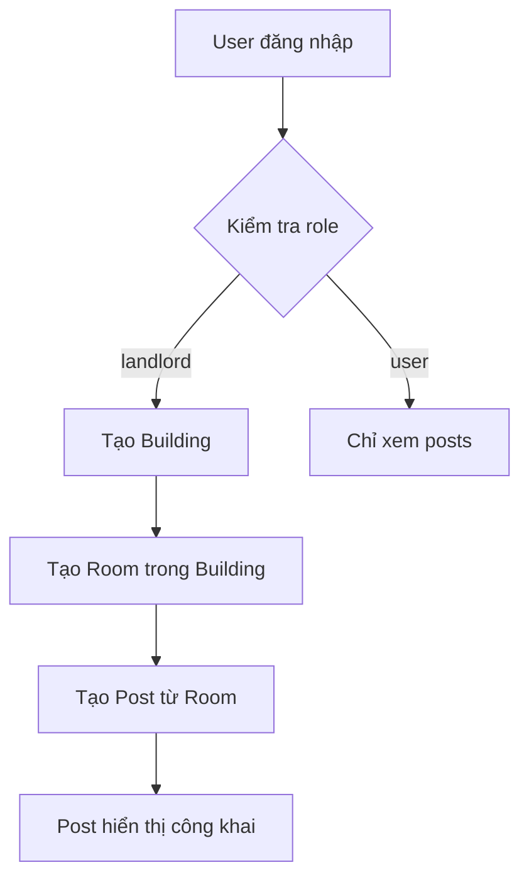

# 🏠 Hướng dẫn Frontend - Luồng Tạo Building → Room → Post

## 📋 **Tổng quan luồng**



## 🔐 **1. Xác thực & Phân quyền**

### **Kiểm tra role user:**
```javascript
// Sau khi đăng nhập, kiểm tra role
const userRole = localStorage.getItem('userRole'); // 'landlord' hoặc 'user'

if (userRole === 'landlord') {
  // Hiển thị các chức năng landlord
  showLandlordFeatures();
} else {
  // Ẩn các chức năng landlord
  hideLandlordFeatures();
}
```

### **Headers cho API calls:**
```javascript
const headers = {
  'Authorization': `Bearer ${localStorage.getItem('accessToken')}`,
  'Content-Type': 'application/json'
};
```

---

## 🏢 **2. Tạo Building (Chỉ Landlord)**

### **API Endpoint:**
```
POST /api/landlord/buildings
```

### **Request Body:**
```json
{
  "name": "Chung cư ABC",
  "address": {
    "street": "123 Đường ABC",
    "ward": "Phường 1",
    "district": "Quận 1", 
    "city": "TP.HCM"
  },
  "buildingType": "chung-cu",
  "description": "Chung cư cao cấp, view đẹp",
  "images": ["url1", "url2"],
  "videos": ["video1"],
  "amenities": ["thang-may", "ho-boi", "gym"],
  "contactInfo": {
    "phone": "0123456789",
    "email": "landlord@example.com"
  }
}
```

### **Frontend Implementation:**
```javascript
// Form tạo building
const createBuilding = async (buildingData) => {
  try {
    const response = await fetch('/api/landlord/buildings', {
      method: 'POST',
      headers,
      body: JSON.stringify(buildingData)
    });
    
    if (response.ok) {
      const building = await response.json();
      console.log('Building created:', building);
      // Chuyển đến bước tạo room
      navigateToCreateRoom(building.id);
    } else {
      const error = await response.json();
      showError(error.message);
    }
  } catch (error) {
    showError('Lỗi kết nối');
  }
};
```

---

## 🚪 **3. Tạo Room trong Building**

### **API Endpoint:**
```
POST /api/landlord/rooms
```

### **Request Body:**
```json
{
  "buildingId": 1,
  "roomNumber": "A101",
  "floor": 1,
  "area": 25.5,
  "price": 5000000,
  "deposit": 10000000,
  "category": "chung-cu",
  "roomType": "1-phong-ngu",
  "maxOccupancy": 2,
  "description": "Phòng đẹp, đầy đủ tiện nghi",
  "images": ["room1.jpg", "room2.jpg"],
  "videos": ["room-tour.mp4"],
  "amenities": ["dieu-hoa", "wifi", "tu-lanh"],
  "utilities": {
    "electricity": "bao-gom",
    "water": "bao-gom", 
    "internet": "bao-gom"
  },
  "availableFrom": "2024-02-01",
  "isFurnished": true
}
```

### **Frontend Implementation:**
```javascript
// Form tạo room
const createRoom = async (roomData) => {
  try {
    const response = await fetch('/api/landlord/rooms', {
      method: 'POST',
      headers,
      body: JSON.stringify(roomData)
    });
    
    if (response.ok) {
      const room = await response.json();
      console.log('Room created:', room);
      // Chuyển đến bước tạo post
      navigateToCreatePost(room.id);
    } else {
      const error = await response.json();
      showError(error.message);
    }
  } catch (error) {
    showError('Lỗi kết nối');
  }
};
```

---

## 📝 **4. Tạo Post từ Room**

### **API Endpoint:**
```
POST /api/posts
```

### **Request Body:**
```json
{
  "postType": "cho-thue",
  "title": "Căn hộ chung cư cao cấp, view thành phố đẹp",
  "description": "Căn hộ chung cư mới xây, đầy đủ tiện nghi, view thành phố tuyệt đẹp...",
  "images": ["post1.jpg", "post2.jpg"],
  "videos": ["post-video.mp4"],
  "roomId": 1,
  "phone": "0123456789",
  "email": "landlord@example.com"
}
```

### **Frontend Implementation:**
```javascript
// Form tạo post
const createPost = async (postData) => {
  try {
    const response = await fetch('/api/posts', {
      method: 'POST',
      headers,
      body: JSON.stringify(postData)
    });
    
    if (response.ok) {
      const post = await response.json();
      console.log('Post created:', post);
      showSuccess('Đăng bài thành công!');
      // Chuyển đến trang quản lý posts
      navigateToManagePosts();
    } else {
      const error = await response.json();
      showError(error.message);
    }
  } catch (error) {
    showError('Lỗi kết nối');
  }
};
```

---

## 🔄 **5. Luồng hoàn chỉnh Frontend**

### **Component Structure:**
```jsx
// App.jsx
function App() {
  const [userRole, setUserRole] = useState(null);
  const [currentStep, setCurrentStep] = useState('building');
  
  return (
    <div>
      {userRole === 'landlord' && (
        <LandlordFlow 
          currentStep={currentStep}
          onStepChange={setCurrentStep}
        />
      )}
      {userRole === 'user' && (
        <UserView />
      )}
    </div>
  );
}

// LandlordFlow.jsx
function LandlordFlow({ currentStep, onStepChange }) {
  const [buildingData, setBuildingData] = useState(null);
  const [roomData, setRoomData] = useState(null);
  
  return (
    <div>
      {currentStep === 'building' && (
        <CreateBuildingForm 
          onSuccess={(building) => {
            setBuildingData(building);
            onStepChange('room');
          }}
        />
      )}
      
      {currentStep === 'room' && buildingData && (
        <CreateRoomForm 
          buildingId={buildingData.id}
          onSuccess={(room) => {
            setRoomData(room);
            onStepChange('post');
          }}
        />
      )}
      
      {currentStep === 'post' && roomData && (
        <CreatePostForm 
          roomId={roomData.id}
          onSuccess={() => {
            onStepChange('complete');
          }}
        />
      )}
    </div>
  );
}
```

### **Form Components:**

#### **CreateBuildingForm.jsx:**
```jsx
function CreateBuildingForm({ onSuccess }) {
  const [formData, setFormData] = useState({
    name: '',
    address: { street: '', ward: '', district: '', city: '' },
    buildingType: 'chung-cu',
    description: '',
    images: [],
    videos: [],
    amenities: [],
    contactInfo: { phone: '', email: '' }
  });

  const handleSubmit = async (e) => {
    e.preventDefault();
    try {
      const response = await fetch('/api/landlord/buildings', {
        method: 'POST',
        headers: {
          'Authorization': `Bearer ${localStorage.getItem('accessToken')}`,
          'Content-Type': 'application/json'
        },
        body: JSON.stringify(formData)
      });
      
      if (response.ok) {
        const building = await response.json();
        onSuccess(building);
      }
    } catch (error) {
      console.error('Error creating building:', error);
    }
  };

  return (
    <form onSubmit={handleSubmit}>
      <h2>Tạo Building</h2>
      
      <div>
        <label>Tên building:</label>
        <input 
          type="text" 
          value={formData.name}
          onChange={(e) => setFormData({...formData, name: e.target.value})}
          required
        />
      </div>
      
      <div>
        <label>Loại building:</label>
        <select 
          value={formData.buildingType}
          onChange={(e) => setFormData({...formData, buildingType: e.target.value})}
        >
          <option value="chung-cu">Chung cư</option>
          <option value="nha-nguyen-can">Nhà nguyên căn</option>
          <option value="phong-tro">Phòng trọ</option>
        </select>
      </div>
      
      {/* Các field khác... */}
      
      <button type="submit">Tạo Building</button>
    </form>
  );
}
```

#### **CreateRoomForm.jsx:**
```jsx
function CreateRoomForm({ buildingId, onSuccess }) {
  const [formData, setFormData] = useState({
    buildingId: buildingId,
    roomNumber: '',
    floor: 1,
    area: 0,
    price: 0,
    deposit: 0,
    category: 'chung-cu',
    roomType: '1-phong-ngu',
    maxOccupancy: 1,
    description: '',
    images: [],
    videos: [],
    amenities: [],
    utilities: {
      electricity: 'bao-gom',
      water: 'bao-gom',
      internet: 'bao-gom'
    },
    availableFrom: '',
    isFurnished: false
  });

  const handleSubmit = async (e) => {
    e.preventDefault();
    try {
      const response = await fetch('/api/landlord/rooms', {
        method: 'POST',
        headers: {
          'Authorization': `Bearer ${localStorage.getItem('accessToken')}`,
          'Content-Type': 'application/json'
        },
        body: JSON.stringify(formData)
      });
      
      if (response.ok) {
        const room = await response.json();
        onSuccess(room);
      }
    } catch (error) {
      console.error('Error creating room:', error);
    }
  };

  return (
    <form onSubmit={handleSubmit}>
      <h2>Tạo Room</h2>
      
      <div>
        <label>Số phòng:</label>
        <input 
          type="text" 
          value={formData.roomNumber}
          onChange={(e) => setFormData({...formData, roomNumber: e.target.value})}
          required
        />
      </div>
      
      <div>
        <label>Diện tích (m²):</label>
        <input 
          type="number" 
          value={formData.area}
          onChange={(e) => setFormData({...formData, area: parseFloat(e.target.value)})}
          required
        />
      </div>
      
      <div>
        <label>Giá thuê (VND):</label>
        <input 
          type="number" 
          value={formData.price}
          onChange={(e) => setFormData({...formData, price: parseInt(e.target.value)})}
          required
        />
      </div>
      
      {/* Các field khác... */}
      
      <button type="submit">Tạo Room</button>
    </form>
  );
}
```

#### **CreatePostForm.jsx:**
```jsx
function CreatePostForm({ roomId, onSuccess }) {
  const [formData, setFormData] = useState({
    postType: 'cho-thue',
    title: '',
    description: '',
    images: [],
    videos: [],
    roomId: roomId,
    phone: '',
    email: ''
  });

  const handleSubmit = async (e) => {
    e.preventDefault();
    try {
      const response = await fetch('/api/posts', {
        method: 'POST',
        headers: {
          'Authorization': `Bearer ${localStorage.getItem('accessToken')}`,
          'Content-Type': 'application/json'
        },
        body: JSON.stringify(formData)
      });
      
      if (response.ok) {
        const post = await response.json();
        onSuccess(post);
      }
    } catch (error) {
      console.error('Error creating post:', error);
    }
  };

  return (
    <form onSubmit={handleSubmit}>
      <h2>Tạo Post</h2>
      
      <div>
        <label>Loại bài đăng:</label>
        <select 
          value={formData.postType}
          onChange={(e) => setFormData({...formData, postType: e.target.value})}
        >
          <option value="cho-thue">Cho thuê</option>
          <option value="tim-o-ghep">Tìm ở ghép</option>
        </select>
      </div>
      
      <div>
        <label>Tiêu đề:</label>
        <input 
          type="text" 
          value={formData.title}
          onChange={(e) => setFormData({...formData, title: e.target.value})}
          required
        />
      </div>
      
      <div>
        <label>Mô tả:</label>
        <textarea 
          value={formData.description}
          onChange={(e) => setFormData({...formData, description: e.target.value})}
          required
        />
      </div>
      
      {/* Các field khác... */}
      
      <button type="submit">Đăng bài</button>
    </form>
  );
}
```

---

## 📱 **6. User Interface (Chỉ xem posts)**

### **API Endpoint:**
```
GET /api/posts
```

### **Frontend Implementation:**
```jsx
// UserView.jsx
function UserView() {
  const [posts, setPosts] = useState([]);
  const [loading, setLoading] = useState(true);

  useEffect(() => {
    fetchPosts();
  }, []);

  const fetchPosts = async () => {
    try {
      const response = await fetch('/api/posts');
      if (response.ok) {
        const data = await response.json();
        setPosts(data);
      }
    } catch (error) {
      console.error('Error fetching posts:', error);
    } finally {
      setLoading(false);
    }
  };

  if (loading) return <div>Loading...</div>;

  return (
    <div>
      <h1>Danh sách bài đăng</h1>
      {posts.map(post => (
        <PostCard key={post.id} post={post} />
      ))}
    </div>
  );
}

// PostCard.jsx
function PostCard({ post }) {
  return (
    <div className="post-card">
      <h3>{post.title}</h3>
      <p>{post.description}</p>
      <p>Giá: {post.price?.toLocaleString()} VND</p>
      <p>Loại: {post.category}</p>
      {post.images && post.images.length > 0 && (
        
      )}
    </div>
  );
}
```

---

## 🚨 **7. Xử lý lỗi**

### **Error Handling:**
```javascript
const handleApiError = (error, response) => {
  if (response?.status === 401) {
    // Token hết hạn, redirect đến login
    localStorage.removeItem('accessToken');
    window.location.href = '/login';
  } else if (response?.status === 403) {
    // Không có quyền truy cập
    showError('Bạn không có quyền thực hiện hành động này');
  } else if (response?.status === 400) {
    // Lỗi validation
    const errorData = await response.json();
    showError(errorData.message.join(', '));
  } else {
    // Lỗi khác
    showError('Có lỗi xảy ra, vui lòng thử lại');
  }
};
```

---

## 📋 **8. Checklist tích hợp**

### **✅ Frontend cần làm:**
- [ ] Tạo component `CreateBuildingForm`
- [ ] Tạo component `CreateRoomForm` 
- [ ] Tạo component `CreatePostForm`
- [ ] Tạo component `UserView` (xem posts)
- [ ] Implement error handling
- [ ] Implement loading states
- [ ] Implement form validation
- [ ] Implement image/video upload
- [ ] Implement role-based UI
- [ ] Implement navigation flow

### **✅ Backend đã có:**
- [x] API tạo building
- [x] API tạo room
- [x] API tạo post
- [x] API lấy danh sách posts
- [x] Authentication & Authorization
- [x] Role-based access control

---

## 🎯 **9. Kết quả cuối cùng**

Sau khi tích hợp xong, user sẽ có thể:

1. **Landlord:**
   - Tạo building → Tạo room → Tạo post
   - Quản lý tất cả building/room/post của mình
   - Xem danh sách posts công khai

2. **User thường:**
   - Xem danh sách posts công khai
   - Tìm kiếm posts theo tiêu chí
   - Liên hệ với landlord

**Luồng hoàn chỉnh và sẵn sàng sử dụng!** 🚀
