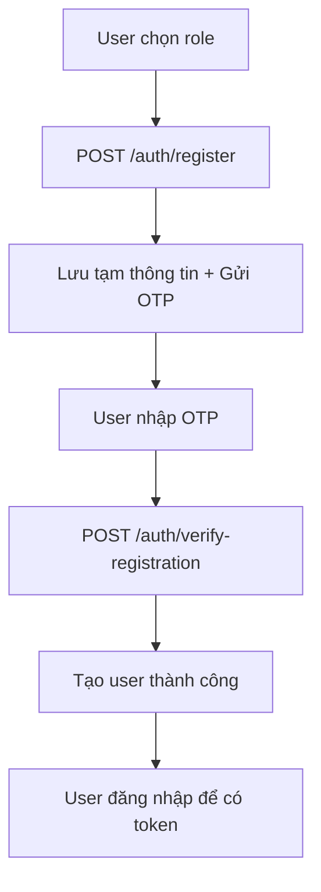
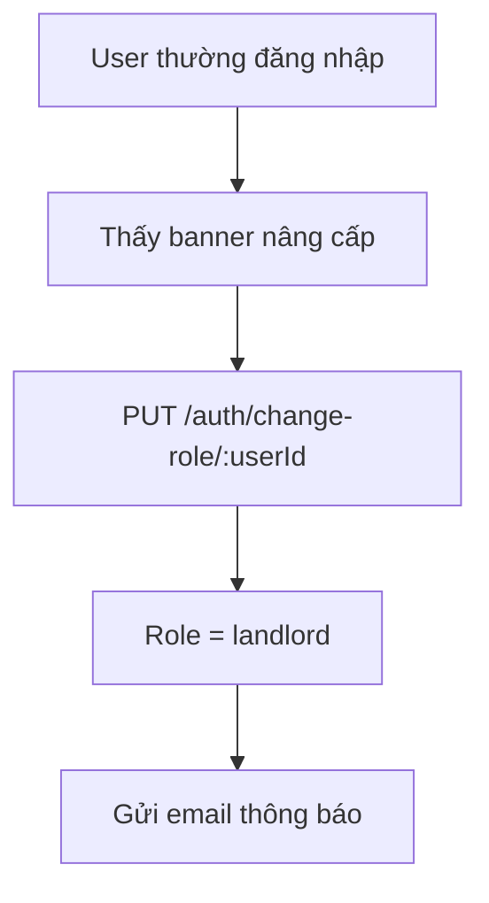

# 🔐 Registration & Role Management System

> **Hệ thống đăng ký với 2 role và xác thực OTP email**

## 🎯 Overview

### 2 Scenarios chính:
1. **Đăng ký mới**: User chọn role ngay từ đầu + xác thực OTP
2. **Đổi role**: User thường → chủ trọ (không cần OTP)

### 🔒 Security Features:
- ✅ OTP email verification (chỉ lần đầu)
- ✅ JWT authentication
- ✅ Password hashing
- ✅ Email validation

---

## 📋 API Endpoints

### 1. Đăng ký tài khoản mới
```http
POST /api/auth/register
```

**Request Body:**
```json
{
  "name": "Nguyễn Văn A",
  "email": "nguyenvana@gmail.com",
  "password": "password123",
  "phone": "0123456789",
  "role": "user"  // hoặc "landlord"
}
```

**Response:**
```json
{
  "message": "Mã OTP đã được gửi đến email của bạn",
  "email": "nguyenvana@gmail.com",
  "expiresIn": 300
}
```

**Validation Rules:**
- `name`: Required, min 2 characters
- `email`: Required, valid email format
- `password`: Required, min 6 characters
- `phone`: Optional
- `role`: Required, enum: ["user", "landlord"]

### 2. Xác thực OTP và tạo tài khoản
```http
POST /api/auth/verify-registration
```

**Request Body:**
```json
{
  "email": "nguyenvana@gmail.com",
  "otp": "123456"
}
```

**Response:**
```json
{
  "message": "Đăng ký thành công. Vui lòng đăng nhập để sử dụng tài khoản.",
  "user": {
    "userId": 1,
    "name": "Nguyễn Văn A",
    "email": "nguyenvana@gmail.com",
    "phone": "0123456789",
    "role": "user",
    "isEmailVerified": true,
    "emailVerifiedAt": "2024-01-15T10:30:00.000Z",
    "createdAt": "2024-01-15T10:30:00.000Z",
    "updatedAt": "2024-01-15T10:30:00.000Z"
  }
}
```

### 3. Đổi role (User → Landlord)
```http
PUT /api/auth/change-role/:userId
Authorization: Bearer <token>
```

**Request Body:**
```json
{
  "role": "landlord"
}
```

**Response:**
```json
{
  "message": "Đổi role thành công",
  "user": {
    "userId": 1,
    "name": "Nguyễn Văn A",
    "email": "nguyenvana@gmail.com",
    "role": "landlord",
    "isEmailVerified": true
  }
}
```

### 4. Gửi lại OTP
```http
POST /api/auth/resend-otp
```

**Request Body:**
```json
{
  "email": "nguyenvana@gmail.com"
}
```

**Response:**
```json
{
  "message": "Mã OTP đã được gửi lại",
  "email": "nguyenvana@gmail.com",
  "expiresIn": 300
}
```

---

## 🔄 Flow Implementation

### Flow 1: Đăng ký mới


### Flow 2: Đổi role


---

## 📧 Email Templates

### OTP Email Template
```html
<!DOCTYPE html>
<html>
<head>
    <title>Xác thực OTP - Nhà Chung</title>
</head>
<body>
    <div class="header">
        <h1>🏠 Nhà Chung</h1>
        <p>Nền tảng tìm kiếm nhà ở hàng đầu Việt Nam</p>
    </div>
    
    <div class="content">
        <h2>Xin chào {{userName}}!</h2>
        <p>Để hoàn tất quá trình đăng ký, vui lòng sử dụng mã OTP bên dưới:</p>
        
        <div class="otp-code">
            <h2>{{otp}}</h2>
        </div>
        
        <div class="warning">
            <strong>⚠️ Lưu ý quan trọng:</strong>
            <ul>
                <li>Mã OTP có hiệu lực trong <strong>5 phút</strong></li>
                <li>Mã chỉ có thể sử dụng <strong>1 lần duy nhất</strong></li>
                <li>Không chia sẻ mã này với bất kỳ ai</li>
            </ul>
        </div>
    </div>
</body>
</html>
```

### Role Change Notification Template
```html
<!DOCTYPE html>
<html>
<head>
    <title>Thay đổi vai trò - Nhà Chung</title>
</head>
<body>
    <div class="header">
        <h1>🏠 Nhà Chung</h1>
        <p>Thông báo thay đổi vai trò</p>
    </div>
    
    <div class="content">
        <h2>Xin chào {{userName}}!</h2>
        
        <div class="success-box">
            <h3>✅ Thay đổi vai trò thành công!</h3>
            <p>Vai trò của bạn đã được cập nhật thành: <strong>{{newRole}}</strong></p>
        </div>
        
        <p><strong>🎉 Chúc mừng bạn đã trở thành Chủ trọ!</strong></p>
        <p>Bây giờ bạn có thể:</p>
        <ul>
            <li>📝 Đăng bài cho thuê phòng trọ</li>
            <li>🏠 Đăng bài cho thuê chung cư</li>
            <li>🏘️ Đăng bài cho thuê nhà nguyên căn</li>
            <li>📊 Quản lý các bài đăng của mình</li>
        </ul>
    </div>
</body>
</html>
```

---

## 🗄️ Database Schema

### Users Collection (Updated)
```typescript
interface User {
  userId: number;                    // Auto increment
  name: string;                      // Required
  email: string;                     // Required, unique
  password: string;                  // Hashed
  phone?: string;                    // Optional
  role: 'user' | 'landlord';        // Default: 'user'
  avatar?: string;                   // Optional
  isEmailVerified: boolean;          // Default: false
  emailVerifiedAt?: Date;            // Set when OTP verified
  isVerified: boolean;               // Identity verification
  verificationId?: number;           // Link to verification
  createdAt: Date;
  updatedAt: Date;
}
```

### Email Verification Collection
```typescript
interface EmailVerification {
  verificationId: number;            // Auto increment
  email: string;                     // Required
  otp: string;                       // 6-digit OTP
  type: 'registration';              // Only registration
  userId?: number;                   // null for new registration
  expiresAt: Date;                   // 5 minutes from creation
  isUsed: boolean;                   // Default: false
  createdAt: Date;
  updatedAt: Date;
}
```

---

## 🛠️ Frontend Integration

### React Registration Form
```typescript
// components/RegistrationForm.tsx
import { useState } from 'react';

const RegistrationForm = () => {
  const [step, setStep] = useState<'form' | 'otp'>('form');
  const [formData, setFormData] = useState(null);
  const [otp, setOtp] = useState('');

  const handleSubmit = async (data) => {
    try {
      // Step 1: Gửi thông tin đăng ký
      await api.post('/auth/register', data);
      setFormData(data);
      setStep('otp');
    } catch (error) {
      console.error('Registration error:', error);
    }
  };

  const handleVerifyOTP = async () => {
    try {
      // Step 2: Xác thực OTP và tạo tài khoản
      const result = await api.post('/auth/verify-registration', {
        email: formData.email,
        otp: otp
      });
      
      // Redirect to login page
      router.push('/login');
    } catch (error) {
      console.error('OTP verification error:', error);
    }
  };

  return (
    <div>
      {step === 'form' ? (
        <RegistrationFormStep onSubmit={handleSubmit} />
      ) : (
        <OTPVerificationStep 
          email={formData.email}
          onVerify={handleVerifyOTP}
          onResend={() => api.post('/auth/resend-otp', { email: formData.email })}
        />
      )}
    </div>
  );
};
```

### Role Upgrade Banner
```typescript
// components/RoleUpgradeBanner.tsx
const RoleUpgradeBanner = ({ user }) => {
  const [loading, setLoading] = useState(false);

  if (user.role === 'landlord') return null;

  const handleUpgrade = async () => {
    setLoading(true);
    try {
      await api.put(`/auth/change-role/${user.userId}`, {
        role: 'landlord'
      });
      
      // Refresh user data
      window.location.reload();
    } catch (error) {
      console.error('Role upgrade error:', error);
    } finally {
      setLoading(false);
    }
  };

  return (
    <div className="role-upgrade-banner">
      <div className="banner-content">
        <h3>Nếu bạn cũng có nơi ở cần cho thuê?</h3>
        <p>Hãy tham gia cùng chúng tôi</p>
        <button 
          onClick={handleUpgrade}
          disabled={loading}
        >
          {loading ? 'Đang xử lý...' : 'Đăng kí ngay để trở thành người cho thuê'}
        </button>
      </div>
    </div>
  );
};
```

---

## 🔒 Security Features

### 1. OTP Security
- **6-digit OTP** với thời hạn 5 phút
- **One-time use** - chỉ sử dụng 1 lần
- **Auto cleanup** - tự động xóa OTP hết hạn
- **Rate limiting** - giới hạn số lần gửi OTP

### 2. Password Security
- **bcrypt hashing** với salt rounds = 10
- **Minimum 6 characters** requirement
- **JWT tokens** với expiration 7 days

### 3. Email Security
- **Email validation** - kiểm tra format
- **Unique email** - không trùng lặp
- **SMTP authentication** - Gmail App Password

---

## ⚠️ Error Handling

### Common Error Responses
```json
// Email already exists (409)
{
  "statusCode": 409,
  "message": "Email đã được sử dụng",
  "error": "Conflict"
}

// Invalid OTP (401)
{
  "statusCode": 401,
  "message": "Mã OTP không hợp lệ hoặc đã hết hạn",
  "error": "Unauthorized"
}

// Email not verified (401)
{
  "statusCode": 401,
  "message": "Vui lòng xác thực email trước khi đổi role",
  "error": "Unauthorized"
}

// User not found (404)
{
  "statusCode": 404,
  "message": "User không tồn tại",
  "error": "Not Found"
}
```

---

## 🧪 Testing

### Test Registration Flow
```bash
# 1. Đăng ký
curl -X POST http://localhost:3001/api/auth/register \
  -H "Content-Type: application/json" \
  -d '{
    "name": "Test User",
    "email": "test@example.com",
    "password": "password123",
    "role": "user"
  }'

# 2. Xác thực OTP (thay 123456 bằng OTP thật)
curl -X POST http://localhost:3001/api/auth/verify-registration \
  -H "Content-Type: application/json" \
  -d '{
    "email": "test@example.com",
    "otp": "123456"
  }'
```

### Test Role Change
```bash
# Đổi role (thay <token> bằng JWT token)
curl -X PUT http://localhost:3001/api/auth/change-role/1 \
  -H "Content-Type: application/json" \
  -H "Authorization: Bearer <token>" \
  -d '{
    "role": "landlord"
  }'
```

---

## 📝 Notes

### Important Considerations:
1. **OTP chỉ gửi 1 lần** - không spam email
2. **Role change không cần OTP** - vì email đã verified
3. **Email templates** - đẹp và professional
4. **Error handling** - đầy đủ và user-friendly
5. **Security** - bcrypt, JWT, validation
6. **Clean Architecture** - Tách biệt rõ ràng các module
7. **Type Safety** - TypeScript với proper typing
8. **Memory Management** - Auto cleanup temp data

### Code Quality:
- ✅ **Clean Code** - Tách method nhỏ, dễ đọc
- ✅ **Error Handling** - Comprehensive error messages
- ✅ **Type Safety** - Proper TypeScript types
- ✅ **Security** - Password hashing, JWT tokens
- ✅ **Performance** - Efficient database queries
- ✅ **Maintainability** - Modular structure

### Future Enhancements:
- [ ] SMS OTP option
- [ ] Social login (Google, Facebook)
- [ ] Two-factor authentication
- [ ] Email templates customization
- [ ] Admin panel for user management
- [ ] Redis cache for temp registrations
- [ ] Rate limiting for OTP requests
